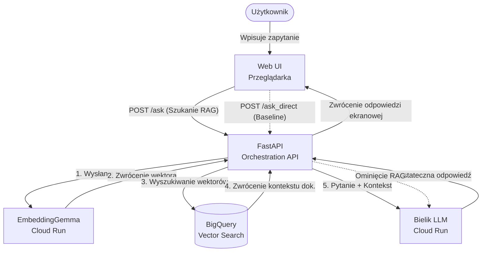
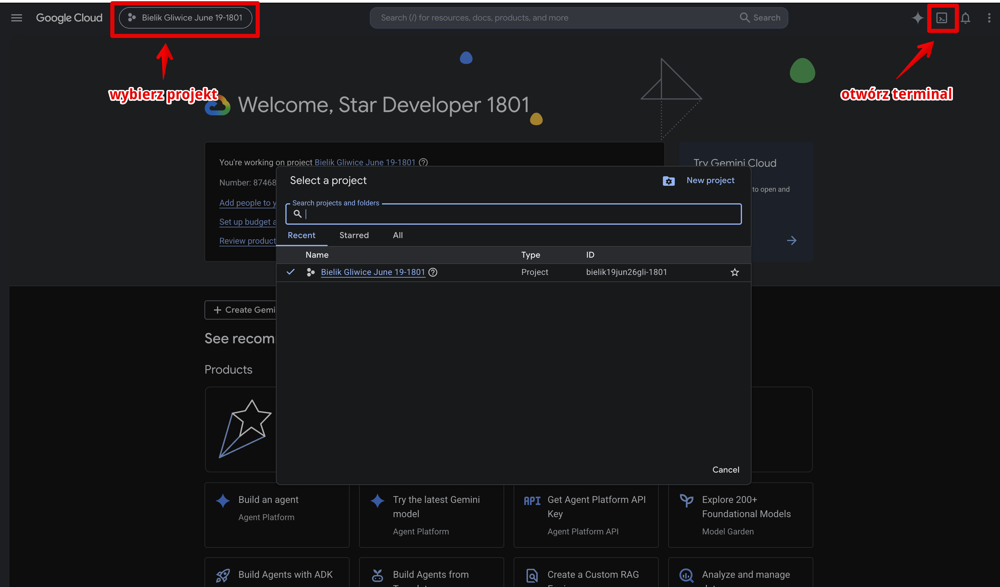

# Eskadra Bielik - Misja 2 - RAG w oparciu o model Bielik i Google Cloud

Suwerenne i wiarygodne AI - Od dokumentów firmowych do inteligentnej bazy wiedzy w oparciu o model Bielik i Google Cloud.

> [!NOTE]
> To repozytorium jest forkiem projektu [eskadra-bielik-misja2](https://github.com/avedave/eskadra-bielik-misja2) autorstwa [Dawida Ostrowskiego z Google](https://github.com/avedave) oraz forkiem projektu Grzegorza Brzezinki [eskadra-bielik-misja2](https://github.com/agentGreg/eskadra-bielik-misja2). Oficjalna wersja oryginalna dostępna jest pod adresem: https://github.com/avedave/eskadra-bielik-misja2. Niniejsza wersja zawiera dodatkowe modyfikacje i rozszerzenia względem oryginału.

> [!WARNING]
>**Materiał warsztatowy — wyłącznie do celów edukacyjnych.**
>Kod i konfiguracja zawarte w tym repozytorium nie są przystosowane do wdrożeń produkcyjnych. Celowo pominięto m.in. uwierzytelnianie API, zarządzanie sekretami, monitoring oraz limity kosztów, aby uprościć przebieg warsztatu i skupić się na zrozumieniu architektury RAG.

## O projekcie

Niniejsze repozytorium prezentuje kompletne, bezserwerowe (serverless) rozwiązanie klasy RAG (Retrieval-Augmented Generation) wdrożone w chmurze Google Cloud. Głównym celem aplikacji jest dostarczenie wydajnego i suwerennego inteligentnego asystenta zdolnego do odpowiadania na pytania użytkownika w oparciu o dedykowaną bazę wiedzy (np. wewnętrzne dokumenty, regulaminy).

Podstawowa architektura wdrażanego rozwiązania opiera się na poniższych serwisach i komponentach:
- **Modelu językowym LLM:** Suwerenny polski model [Bielik](https://ollama.com/SpeakLeash/bielik-4.5b-v3.0-instruct) charakteryzujący się bardzo dobrym zrozumieniem języka polskiego oraz polskiego kontekstu kulturowego. Uruchomiony w usłudze Cloud Run, odpowiada za ostateczne generowanie naturalnej dla użytkownika odpowiedzi.
- **Modelu osadzania (Embedding):** Wydajny model [EmbeddingGemma](https://deepmind.google/models/gemma/embeddinggemma/) uruchomiony w usłudze Cloud Run, służący do szybkiej zamiany tekstu (zapytań użytkownika i dokumentów docelowych) na reprezentację wektorową.
- **Wektorowej Bazie Wiedzy:** Skalowalna hurtownia danych [BigQuery](https://cloud.google.com/bigquery?hl=en) z mechanizmem Vector Search zapewniająca wektorowe wyszukiwanie semantycznie dopasowanych fragmentów z pośród milionów dokumentów źródłowych.
- **Logice i serwerze aplikacyjnym:** Aplikacja napisana w języku Python (z frameworkiem FastAPI), udostępniająca nakładkę graficzną Web UI oraz publiczne API spinające platformy w całość.

Dodatkowo, dzięki prostemu interfejsowi graficznemu, aplikacja pozwala na wygodne porównanie i empiryczne przetestowanie "surowego" modelu Bielik polegającego tylko na sobie w konfrontacji z bogatszym strumieniem odpowiedzi nowocześniejszego RAG wspomaganego dedykowanym własnym kontekstem.

### Architektura Systemu

Poniższy diagram ilustruje główne komponenty aplikacji oraz przepływ danych w przypadku zadawania pytania za pośrednictwem mechanizmu RAG:



## Z czego składa się kod?

Przykładowy kod źródłowy zawarty w tym repozytorium pozwala w szczególności na:

* Skonfigurowanie własnej instancji modelu [Bielik](https://ollama.com/SpeakLeash/bielik-4.5b-v3.0-instruct) w oparciu o silnik [Ollama](https://ollama.com/)

* Skonfigurowanie własnej instancji modelu osadzającego (embedding model) [EmbeddingGemma](https://deepmind.google/models/gemma/embeddinggemma/) w oparciu o [Ollama](https://ollama.com/)

* Uruchomienie obu powyższych modeli na platformie typu bezserwerowego: [Cloud Run](https://cloud.google.com/run?hl=en)

* Skonfigurowanie bazy wektorów w [BigQuery](https://cloud.google.com/bigquery?hl=en) wraz ze specjalnym zaawansowanym przeszukiwaniem [BigQuery Vector Search](https://docs.cloud.google.com/bigquery/docs/vector-search)

## Jak czytać ten przewodnik

> [!TIP]
> Zanim zaczniesz, zwróć uwagę na trzy konwencje zapisu komend:
> - **`<NAZWA_W_NAWIASACH>`** — placeholder, czyli miejsce do podmiany na własną wartość (np. `<ID_TWOJEGO_PROJEKTU>`). Nawiasy `< >` usuwasz.
> - **`$ZMIENNA`** — zmienna środowiskowa wczytana przez `source setup_env.sh` (np. `$PROJECT_ID`, `$REGION`). Po nowym terminalu trzeba ją wczytać ponownie.
> - **`$(komenda)`** — podstawienie wyniku komendy w miejscu (np. `$(gcloud config get-value account)`).
>
> Jeśli komenda „nie działa", najpierw sprawdź czy uruchomiłeś `source setup_env.sh` w bieżącym terminalu.

## Agenda warsztatu

| # | Etap | Czas | Punkty |
|---|------|------|--------|
| 1 | Projekt GCP, dane i zmienne środowiskowe | ~15 min | +5 |
| 2 | Usługi i uprawnienia Google Cloud | ~10 min | +10 |
| 3 | Model Bielik (LLM) na Cloud Run | ~15 min | +15 |
| 4 | Model EmbeddingGemma na Cloud Run | ~10 min | +10 |
| 5 | Wektorowa baza BigQuery | ~5 min | +10 |
| 6 | API Orchestration na Cloud Run | ~10 min | +15 |
| 7 | Zasilanie i wyszukiwanie RAG | ~10 min | +15 |
| 8 | Przegląd API (`/docs`) | ~5 min | +5 |
| 9 | Interfejs Web UI | ~5 min | +15 |
| ★ | Certyfikat | ~5 min | 100/100 |

Łącznie **~90 min** i **100 pkt**. Po każdym etapie uruchamiasz checkpoint (blok „✅ Zalicz krok"), który sprawdza poprawność i melduje Twój postęp na tablicę wyników na rzutniku.

## 1. Przygotowanie projektu Google Cloud i konfiguracja zmiennych środowiskowych

1. Uruchom przeglądarkę w **trybie incognito**.

2. Przejdź do **Google Cloud Console**: [console.cloud.google.com](https://console.cloud.google.com)
   
3. Zaloguj się na konto frictionless, które otrzymałeś od agetaGrega. 

4. Wybierz projekt **Bielik ... ...**
>[!TIP]
>Możesz sprawdzić dostępność kredytów OnRamp wybierając z menu po lewej stronie: Billing / Credits



1. Otwórz terminal Cloud Shell ([dokumentacja](https://cloud.google.com/shell/docs))

2. Zweryfikuj konto które jest zalogowane w Cloud Shell
   ```bash
   gcloud auth list
   ```
>[!TIP]
>Jeżeli konto nie jest zalogowane, lub jest to inne konto niż to z dostępem do Twojego projektu Google Cloud, zaloguj się za pomocą komendy: `gcloud auth login`

1. Potwierdź, że wybrany jest odpowiedni projekt Google Cloud
   ```bash
   gcloud config get project
   ```
>[!TIP]
>Jeżeli projekt jest nieodpowiedni, zmień go za pomocą komendy: `gcloud config set project <ID_TWOJEGO_PROJEKTU>`

>[!CAUTION]
>Nie pomyl nazwy projektu z ID projektu! Nie zawsze są one takie same.

7. Sklonuj repozytorium z przykładowym kodem i przejdź do nowoutworzonego katalogu
   ```bash
   git clone https://github.com/suchecki300/eskadra-bielika-misja2
   ```

8. Przejdź do katalogu z kodem źródłowym
   ```bash
   cd eskadra-bielik-misja2
   ```

9. Uruchom edytor w katalogu z kodem źródłowym
   ```bash
   cloudshell workspace .
   ```

10. Otwórz `setup_env.sh` w edytorze i przeanalizuj go.
11. **Uzupełnij swoje dane warsztatowe** w `setup_env.sh` - wypełnij 4 linie w sekcji „UZUPEŁNIJ SWOJE DANE":
    ```bash
    export WORKSHOP_NICK="TwojNick"            # nick na TABLICĘ na rzutniku (publiczny)
    export WORKSHOP_FIRST_NAME="Imię"          # do certyfikatu (NIE trafia na tablicę)
    export WORKSHOP_LAST_NAME="Nazwisko"
    export WORKSHOP_EMAIL="email@przyklad.pl"
    ```
    > Nick jest widoczny publicznie na tablicy wyników. Imię, nazwisko i email służą wyłącznie do oficjalnego certyfikatu (wystawia organizator — Bielik AI) i nie pojawiają się na tablicy.

12. Uruchom skrypt `setup_env.sh` (po każdym otwarciu nowego terminala):
   ```bash
   source setup_env.sh
   ```
   Po uruchomieniu zobaczysz potwierdzenie z Twoim nickiem i imieniem. Jeśli pojawi się ostrzeżenie „nie ustawiłeś swoich danych" — uzupełnij je w `setup_env.sh`.
>[!IMPORTANT]
>Jeżeli z jakiegoś powodu musisz ponownie uruchomić terminal Cloud Shell, pamiętaj aby ponownie uruchomić skrypt `setup_env.sh` aby wczytać zmienne środowiskowe.

**✅ Zalicz krok — +5 pkt.** Sprawdź, że projekt jest gotowy, i wyślij postęp na tablicę:
```bash
./checkpoints/checkpoint_1.sh
```
<details><summary>Przykładowe wyjście</summary>

```text
  [OK]  Konto: jan.kowalski@gmail.com
  [OK]  Projekt: bielik-warsztat-jk
  [OK]  Billing aktywny
======================================================
  CHECKPOINT 1 ZALICZONY — Projekt Google Cloud
  Punkty: +5  (łącznie 5 / 100)
  Postęp: [#.............................] 5%
  Projekt gotowy. Infrastruktura czeka na uruchomienie!
  Dashboard: wysłano (nick: TwojNick)
  Certyfikat: dane zarejestrowane u prowadzącego
  Artefakt: cert_artifacts/checkpoint_1.enc
======================================================
```
</details>

## 2. Konfiguracja zmiennych środowiskowych i usług Google Cloud

1. Włącz potrzebne usługi w projekcie Google Cloud
   ```bash
   gcloud services enable run.googleapis.com
   gcloud services enable cloudbuild.googleapis.com
   gcloud services enable artifactregistry.googleapis.com
   gcloud services enable bigquery.googleapis.com
   ```
2. Uzyskaj uprawnienia do wywoływania usług Cloud Run
   ```bash
   gcloud projects add-iam-policy-binding $PROJECT_ID \
    --member=user:$(gcloud config get-value account) \
    --role='roles/run.invoker'
   ```  

**✅ Zalicz krok — +10 pkt.** Zweryfikuj zmienne, usługi i uprawnienia:
```bash
./checkpoints/checkpoint_2.sh
```
<details><summary>Przykładowe wyjście</summary>

```text
  [OK]  Zmienne środowiskowe wczytane (source setup_env.sh)
  [OK]  API włączone: run.googleapis.com
  [OK]  API włączone: cloudbuild.googleapis.com
  [OK]  API włączone: artifactregistry.googleapis.com
  [OK]  API włączone: bigquery.googleapis.com
  [OK]  Uprawnienie roles/run.invoker nadane
======================================================
  CHECKPOINT 2 ZALICZONY — Konfiguracja env i usług
  Punkty: +10  (łącznie 15 / 100)
  Postęp: [####..........................] 15%
  Usługi włączone, uprawnienia ustawione. Czas na modele!
  Dashboard: wysłano (nick: TwojNick)
  Artefakt: cert_artifacts/checkpoint_2.enc
======================================================
```
</details>

## 3. Uruchomienie modelu LLM Bielik na Cloud Run

1. Przeanalizuj skrypt `llm/cloud_run.sh`

2. Uruchom skrypt `llm/cloud_run.sh`
   ```bash
   cd llm
   ./cloud_run.sh
   ```
3. Sprawdź status usługi `bielik` w Cloud Console - Cloud Run - Services

4. Przeanalizuj plik `llm/llm_test1.sh` i zadaj pierwsze pytanie modelowi Bielik uruchamiając ten skrypt
   ```bash
   ./llm_test1.sh
   ```
5. Wróć do głównego katalogu projektu
   ```bash
   cd ..
   ```

**✅ Zalicz krok — +15 pkt.** Sprawdź, że Bielik działa na Cloud Run:
```bash
./checkpoints/checkpoint_3.sh
```
<details><summary>Przykładowe wyjście</summary>

```text
  [OK]  Usługa bielik wdrożona: https://bielik-....run.app
  [OK]  Usługa odpowiada (HTTP 200)
======================================================
  CHECKPOINT 3 ZALICZONY — Model Bielik (Cloud Run)
  Punkty: +15  (łącznie 30 / 100)
  Postęp: [#########.....................] 30%
  Bielik mówi po polsku w chmurze. Najtrudniejszy krok za Tobą!
  Dashboard: wysłano (nick: TwojNick)
  Artefakt: cert_artifacts/checkpoint_3.enc
======================================================
```
</details>

## 4. Uruchomienie modelu embeddingowego EmbeddingGemma na Cloud Run

1. Przeanalizuj skrypt `embedding_model/cloud_run.sh`

2. Uruchom skrypt `embedding_model/cloud_run.sh`
   ```bash
   cd embedding_model
   ./cloud_run.sh
   ```
3. Sprawdź status usługi `embedding-gemma` w Cloud Console - Cloud Run - Services

4. Przeanalizuj plik `embedding_model/embedding_test1.sh` i wygeneruj pierwsze testowe embeddingi (wektory) dla przykładowego tekstu uruchamiając ten skrypt
   ```bash
   ./embedding_test1.sh
   ```
5. Wróć do głównego katalogu projektu
   ```bash
   cd ..
   ```

**✅ Zalicz krok — +10 pkt.** Sprawdź model embeddingowy (wektor 768):
```bash
./checkpoints/checkpoint_4.sh
```
<details><summary>Przykładowe wyjście</summary>

```text
  [OK]  Usługa embedding-gemma wdrożona: https://embedding-gemma-....run.app
  [OK]  Embedding ma poprawny wymiar (768)
======================================================
  CHECKPOINT 4 ZALICZONY — Model EmbeddingGemma (Cloud Run)
  Punkty: +10  (łącznie 40 / 100)
  Postęp: [############..................] 40%
  Embedding działa — tekst zamienia się w wektory. Czas na bazę!
  Dashboard: wysłano (nick: TwojNick)
  Artefakt: cert_artifacts/checkpoint_4.enc
======================================================
```
</details>

## 5. Inicjalizacja wektorowej bazy danych w BigQuery

Projekt wykorzystuje BigQuery z funkcją Vector Search jako bazę z wiedzą kontekstową.

1. Przejdź do katalogu `vector_store`
   ```bash
   cd vector_store
   ```

2. Zainstaluj wymagane biblioteki (w środowisku deweloperskim)
   ```bash
   pip install google-cloud-bigquery
   ```

3. Uruchom skrypt inicjalizacyjny, który stworzy zbiór danych i tabelę w BigQuery
   ```bash
   python init_db.py
   ```

4. Wróć do głównego katalogu projektu
   ```bash
   cd ..
   ```

**✅ Zalicz krok — +10 pkt.** Sprawdź, że baza wektorowa istnieje:
```bash
./checkpoints/checkpoint_5.sh
```
<details><summary>Przykładowe wyjście</summary>

```text
  [OK]  Dataset istnieje: rag_dataset
  [OK]  Tabela istnieje: hotel_rules
======================================================
  CHECKPOINT 5 ZALICZONY — Wektorowa baza BigQuery
  Punkty: +10  (łącznie 50 / 100)
  Postęp: [###############...............] 50%
  Baza wektorowa gotowa. Spinamy wszystko w jedno API!
  Dashboard: wysłano (nick: TwojNick)
  Artefakt: cert_artifacts/checkpoint_5.enc
======================================================
```
</details>

## 6. Uruchomienie API (Orchestration) na Cloud Run

1. Przeanalizuj kod aplikacji FastAPI w katalogu `orchestration`

2. Przejdź do katalogu `orchestration`
   ```bash
   cd orchestration
   ```

3. Uruchom skrypt publikujący aplikację na Cloud Run
   ```bash
   ./cloud_run.sh
   ```

4. Po wdrożeniu gcloud wypisze adres URL usługi `orchestration-api`. Zapisz go do zmiennej środowiskowej
   ```bash
   export ORCHESTRATION_URL=$(gcloud run services describe orchestration-api --region $REGION --format="value(status.url)")
   ```

5. Wróć do głównego katalogu
   ```bash
   cd ..
   ```

**✅ Zalicz krok — +15 pkt.** Sprawdź, że API orkiestrujące odpowiada:
```bash
./checkpoints/checkpoint_6.sh
```
<details><summary>Przykładowe wyjście</summary>

```text
  [OK]  Usługa orchestration-api wdrożona: https://orchestration-api-....run.app
  [OK]  Endpoint /health odpowiada (HTTP 200)
======================================================
  CHECKPOINT 6 ZALICZONY — API Orchestration (Cloud Run)
  Punkty: +15  (łącznie 65 / 100)
  Postęp: [###################...........] 65%
  API orkiestrujące żyje. Zostało zasilić bazę i pytać!
  Dashboard: wysłano (nick: TwojNick)
  Artefakt: cert_artifacts/checkpoint_6.enc
======================================================
```
</details>

## 7. Testowanie API - Zasilanie i Wyszukiwanie (RAG)

1. Zasil bazę BigQuery przykładowymi danymi z pliku CSV
   ```bash
   curl -X POST "$ORCHESTRATION_URL/ingest" \
        -F "file=@vector_store/hotel_rules.csv"
   ```

2. Sprawdź w Google Cloud Console -> BigQuery, czy rekordy pojawiły się w tabeli `rag_dataset.hotel_rules` 
   *(Proces indeksowania danych do Vector Search może chwilę potrwać, jednak dane tekstowe widoczne są natychmiast).*

3. Wykonaj testowe zapytanie wykorzystując RAG, dopytujące o informacje z wgranych reguł
   
   Pytanie o częstotliwość pomiaru chloru w basenie:
   ```bash
   curl -X POST "$ORCHESTRATION_URL/ask" \
        -H "Content-Type: application/json" \
        -d '{"query": "Jak często powinien być mierzony poziom chloru w basenie?"}'
   ```

   Pytanie o godzinę podawania śniadania:
   ```bash
   curl -X POST "$ORCHESTRATION_URL/ask" \
        -H "Content-Type: application/json" \
        -d '{"query": "O której godzinie jest podawane śniadanie?"}'
   ```
   
   Pytanie o parking:
   ```bash
   curl -X POST "$ORCHESTRATION_URL/ask" \
        -H "Content-Type: application/json" \
        -d '{"query": "Ile kosztuje parking hotelowy?"}'
   ```

**✅ Zalicz krok — +15 pkt.** Sprawdź, że baza jest zasilona i RAG zwraca kontekst:
```bash
./checkpoints/checkpoint_7.sh
```
<details><summary>Przykładowe wyjście</summary>

```text
  [OK]  Baza zasilona (19 reguł)
  [OK]  RAG /ask zwraca odpowiedź z kontekstem
======================================================
  CHECKPOINT 7 ZALICZONY — Zasilanie i wyszukiwanie RAG
  Punkty: +15  (łącznie 80 / 100)
  Postęp: [########################......] 80%
  RAG w akcji — wyszukiwanie semantyczne działa! Już prawie meta.
  Dashboard: wysłano (nick: TwojNick)
  Artefakt: cert_artifacts/checkpoint_7.enc
======================================================
```
</details>

## 8. Interfejs Programistyczny (API)

Aplikacja udostępnia proste API stworzone przy pomocy frameworka *FastAPI*, pozwalające nie tylko na zasilanie bazy wiedzy, ale również na zadawanie pytań.

Aplikacja definiuje w pliku `orchestration/main.py` następujące ścieżki:

* `GET /` – serwuje statyczny plik interfejsu użytkownika (`index.html`).
* `POST /ingest` – przyjmuje plik CSV i indeksuje zawarte w nim informacje jako wektory w BigQuery (wykorzystując model embeddingowy `EmbeddingGemma`).
* `POST /ask` – główny endpoint RAG: 
  - zamienia zapytanie z tekstu na wektor,
  - wyszukuje semantycznie 3 najbardziej zbliżone dokumenty wektorowe w tabeli BigQuery,
  - buduje prompt z odnalezionym kontekstem,
  - wysyła połączony prompt do modelu `Bielik` i zwraca ostateczną odpowiedź wraz z wybranym i wykorzystanym kontekstem.
* `POST /ask_direct` – służy jako zestawienie porównawcze (baseline). Przyjmuje zapytanie i wysyła je bezpośrednio do bazowego modelu `Bielik`, z całkowitym pominięciem RAG.

Otwórz interaktywną dokumentację API w przeglądarce (Swagger) i przejrzyj endpointy:
```bash
echo "$ORCHESTRATION_URL/docs"
```

**✅ Zalicz krok — +5 pkt.** Sprawdź, że dokumentacja API jest dostępna:
```bash
./checkpoints/checkpoint_8.sh
```
<details><summary>Przykładowe wyjście</summary>

```text
  [OK]  Dokumentacja /docs dostępna (HTTP 200)
  [OK]  OpenAPI zawiera endpoint /ask
======================================================
  CHECKPOINT 8 ZALICZONY — Przegląd API (/docs)
  Punkty: +5  (łącznie 85 / 100)
  Postęp: [#########################.....] 85%
  Dokumentacja przejrzana. Ostatni krok przed Tobą!
  Dashboard: wysłano (nick: TwojNick)
  Artefakt: cert_artifacts/checkpoint_8.enc
======================================================
```
</details>

## 9. Interfejs Użytkownika (Web UI)

Oprócz interfejsu API, aplikacja udostępnia również prostą nakładkę WWW. Całość pozwala na wygodne sprawdzenie i porównanie działania bazowego modelu Bielik z modelem Bielik wspartym przez RAG.

Interfejs użytkownika zaimplementowano w jednym, statycznym pliku: `orchestration/static/index.html`. 

Skrypt osadzony w pliku HTML wysyła dwa jednoczesne żądania do endpointów `/ask` (wsparty RAG) oraz `/ask_direct` (bezpośrednio do modelu `Bielik`) i prezentuje obie odpowiedzi modelu obok siebie celem zilustrowania różnic. Wyświetla obok również jakich dokładnie fragmentów dokumentów BigQuery model użył w przypadku posiłkowania się dodatkowym kontekstem RAG.

### Uruchomienie interfejsu

Aby otworzyć interfejs graficzny testowej aplikacji z poziomu Twojego projektu:

1. Wyświetl i kliknij w adres URL usługi `orchestration-api` uruchamiając w terminalu poniższą komendę:
   ```bash
   echo $ORCHESTRATION_URL
   ```
2. Po otwarciu opublikowanej strony w Twojej przeglądarce internetowej, wpisz w okno dialogowe dowolne zapytanie (np. "Do której godziny jest otwarty basen?") i kliknij "Zapytaj".
3. Porównaj strumień odpowiedzi wyświetlany dla samej bazy wiedzy modelu (bez dodatkowego kontekstu) z bogatszą odpowiedzią RAG wygenerowaną w oparciu o wiedzę z przeszukiwania BigQuery Vector Search.

**✅ Zalicz krok — +15 pkt.** Ostatni krok! Sprawdź, że Web UI działa:
```bash
./checkpoints/checkpoint_9.sh
```
<details><summary>Przykładowe wyjście</summary>

```text
  [OK]  Web UI serwuje stronę (zawiera 'Bielik')

  Gratulacje! To ostatni krok. Wygeneruj certyfikat:
    ./checkpoints/certyfikat_generate.sh
======================================================
  CHECKPOINT 9 ZALICZONY — Interfejs Web UI
  Punkty: +15  (łącznie 100 / 100)
  Postęp: [##############################] 100%
  WARSZTAT UKOŃCZONY! Wygeneruj certyfikat i pochwal się wynikiem!
  Dashboard: wysłano (nick: TwojNick)
  Artefakt: cert_artifacts/checkpoint_9.enc
======================================================
```
</details>

## 10. Sprawdzanie statusu (preflight check)

Po wdrożeniu wszystkich komponentów możesz jedną komendą zweryfikować, czy całość jest gotowa do pracy:

```bash
source setup_env.sh
bash preflight_check.sh
```

Skrypt sprawdza zmienne środowiskowe, trzy usługi Cloud Run (`bielik`, `embedding-gemma`, `orchestration-api`), dataset i tabelę BigQuery oraz odpowiedź HTTP API. Przy każdym błędzie wypisuje gotową komendę naprawczą.

## 11. Najczęstsze problemy

| Objaw | Przyczyna | Rozwiązanie |
|-------|-----------|-------------|
| `$'\r': command not found` przy uruchamianiu skryptu | Skrypt ma zakończenia linii CRLF (Windows) | Repo zawiera `.gitattributes` wymuszający LF — wystarczy ponowny `git clone`. Doraźnie: `sed -i 's/\r$//' nazwa.sh` |
| Komenda zgłasza brak zmiennej (`$PROJECT_ID` puste) | Nowy terminal nie ma wczytanych zmiennych | Uruchom ponownie `source setup_env.sh` |
| Pierwsze zapytanie do modelu trwa długo / `timeout` / HTTP 504 | Zimny start Cloud Run (model ładuje się do GPU) | Poczekaj i ponów. Kolejne zapytania są szybkie. Timeouty w API to 30 s (embedding) / 120 s (LLM) |
| `exec format error` / kontener nie wstaje na Cloud Run | Obraz zbudowany na Macu ARM (M1/M2/M3) | Dockerfile używa `--platform=linux/amd64` — przebuduj obraz |
| HTTP 403 przy `curl` do usługi Cloud Run | Brak tokenu lub uprawnienia `run.invoker` | Dodaj nagłówek `-H "Authorization: Bearer $(gcloud auth print-identity-token)"`; sprawdź IAM z kroku 2 |
| RAG zwraca pustą / słabą odpowiedź | Baza BigQuery jest pusta lub indeks jeszcze się tworzy | Zasil bazę (`/ingest`); indeksowanie Vector Search może chwilę potrwać |
| `bq` / API: dataset lub tabela nie istnieje | Nie zainicjalizowano bazy | `cd vector_store && python init_db.py` |
| Billing/`OnRamp` nieaktywny, usługi się nie tworzą | Brak powiązanych kredytów | Aktywuj kredyt OnRamp i powiąż z projektem (Billing → Credits) |
| GPU niedostępne w regionie | Limit/quota w regionie | Sprawdź dostępność GPU w `$REGION` lub poproś o zwiększenie quoty |

## 12. Tablica postępu na żywo i certyfikat

Twój postęp pojawia się na **tablicy wyników na rzutniku** — pod Twoim **nickiem** (bez danych osobowych). Postęp meldują **checkpointy** uruchamiane po każdym kroku (bloki „✅ Zalicz krok" w sekcjach 1–9). Każdy zalicza punkty (łącznie 100) i wysyła wynik na tablicę.

- **Dane**: upewnij się, że uzupełniłeś je w `setup_env.sh` (krok 2). Nick widać na tablicy; imię, nazwisko i email służą tylko do certyfikatu i są przekazywane raz, prywatnie — nigdy na tablicę.
- **Certyfikat**: po zaliczeniu wszystkich 9 kroków uruchom:
  ```bash
  ./checkpoints/certyfikat_generate.sh
  ```
  Skrypt użyje danych z `setup_env.sh` i utworzy lokalny certyfikat. Oficjalny certyfikat wyśle organizator (Bielik AI).

> [!TIP]
> 📱 **Włącz kamerę w telefonie, zanim uruchomisz `certyfikat_generate.sh`!**
> Generowanie odpala wielki napis **GRATULACJE**, pasek 100% i podsumowanie wszystkich 9 kroków — to moment, który warto mieć na pamiątkę z warsztatu. A potem spójrz na **tablicę wyników na rzutniku** — jest tam Twój nick. Uda się na podium? 🦅

> [!NOTE]
> Modele Bielik i EmbeddingGemma wdrażają się domyślnie z **gotowego, publicznego obrazu** (szybki start, bez budowania). Chcesz zbudować własny obraz ze źródła? Ustaw `export BUILD_FROM_SOURCE=1` przed `./cloud_run.sh`.

> [!TIP]
> Nie chcesz wysyłać postępu na tablicę? `export TRACKING_PROJECT=disabled` przed uruchamianiem checkpointów.

> [!TIP]
> **Eksperymentuj!** Przejrzyj `orchestration/main.py` oraz `orchestration/static/index.html`, aby zobaczyć, jak prosto w Pythonie łączy się wyszukiwanie wektorowe BigQuery z modelem LLM. Spróbuj zmienić instrukcję systemową w `main.py`, aby Bielik zachowywał się jak pirat lub ekspert IT (po zmianie wdróż ponownie: `cd orchestration && ./cloud_run.sh`), pobaw się suwakiem liczby dokumentów w UI i dodaj własną regułę przyciskiem „Dodaj regułę", a potem o nią zapytaj.

## 13. Dla chętnych — pogłębione zrozumienie z Gemini CLI `~30 min` *(opcjonalne)*

> [!NOTE]
> To **bonus po warsztacie** — masz certyfikat, system działa, a chcesz zrozumieć **dlaczego** każdy krok wygląda tak, a nie inaczej? Zadaj pytania poniżej Gemini CLI. Odpowiedź modelu może brzmieć inaczej niż u kolegi i **to jest OK** — modele są niedeterministyczne. Liczy się budowanie własnego modelu mentalnego.

**Jak działa Gemini CLI w Cloud Shell**
- Gemini CLI jest **pre-zainstalowany** w Cloud Shell i uwierzytelnia się automatycznie Twoim kontem Google. Przy pierwszym uruchomieniu wybierz **Trust folder**. Wyjście: `/quit`.
- Pliki kodu są lokalne, więc Gemini działa nawet po `cleanup.sh`. Jeśli zamknąłeś terminal: `cd eskadra-bielik-misja2 && source setup_env.sh`.

> [!WARNING]
> Prompty z `@plik` służą **analizie kodu**, nie uruchamianiu. Każdy zawiera końcową dyrektywę „nie uruchamiaj" — **nie usuwaj jej**, bo Gemini bywa nadgorliwy i potrafi sam wykonać skrypt.

### 🎨 Eksperyment — zmień wygląd interfejsu

Zbudowany system to dopiero początek — każdy fragment możesz zmienić. Najłatwiej zacząć od kolorów Web UI.

Niech AI przerobi motyw za Ciebie:

```bash
chmod +w orchestration/static/index.html
gemini "Zmodyfikuj plik @orchestration/static/index.html: zmień motyw na ciemny (dark mode) z akcentem fioletowym. Zachowaj całą funkcjonalność i strukturę HTML. Nie uruchamiaj pliku."
```
Inny pomysł — retro terminal:
```bash
gemini "Zmodyfikuj @orchestration/static/index.html nadając wygląd retro-terminala: zielony tekst na czarnym tle, czcionka monospace. Zachowaj funkcjonalność. Nie uruchamiaj pliku."
```
Po zmianie wdróż ponownie (`cd orchestration && ./cloud_run.sh && cd ..`), odśwież stronę i pochwal się swoją wersją innym uczestnikom!

**Krok 2 — zmienne i usługi**
```bash
gemini "Co robi skrypt @setup_env.sh? Wyjaśnij każdą zmienną. Nie uruchamiaj pliku ani w sandboxie — pracuj wyłącznie na kodzie źródłowym."
gemini "Jaka jest różnica między 'source setup_env.sh' a './setup_env.sh' w bashu i kiedy używać każdej formy?"
gemini "Dlaczego usługi Google Cloud są domyślnie wyłączone? Wyjaśnij krótko: run, cloudbuild, artifactregistry, bigquery i co się stanie, gdy pominąć włączenie."
gemini "Czym jest IAM w Google Cloud i jak działa rola roles/run.invoker? Jaki błąd HTTP dostanę wołając usługę bez tej roli i dlaczego?"
```

**Krok 3–4 — modele Bielik i EmbeddingGemma**
```bash
gemini "Co robi skrypt @llm/cloud_run.sh? Dlaczego Bielik wymaga GPU NVIDIA L4 — czym różni się przetwarzanie na GPU od CPU dla modeli językowych? Nie uruchamiaj pliku — pracuj na kodzie źródłowym."
gemini "Co robi skrypt @llm/llm_test1.sh? Jak działa token tożsamości (identity token) w Google Cloud — skąd pochodzi, jak długo jest ważny i co się stanie bez nagłówka Authorization? Nie uruchamiaj pliku — pracuj na kodzie źródłowym."
gemini "Co robi @embedding_model/embedding_test1.sh? Wyjaśnij czym jest przestrzeń wektorowa — jak 768 liczb może wyrażać 'znaczenie' tekstu i dlaczego zdania o podobnym sensie dają wektory bliskie sobie geometrycznie? Nie uruchamiaj pliku — pracuj na kodzie źródłowym."
```

**Krok 5 — wektorowa baza BigQuery**
```bash
gemini "Co robi @vector_store/init_db.py? Dlaczego kolumna embedding ma typ FLOAT64 REPEATED, a nie STRING ani JSON — jak BigQuery Vector Search korzysta z tego typu? Nie uruchamiaj pliku — pracuj na kodzie źródłowym."
```

**Krok 6–7 — API i pełny przepływ RAG**
```bash
gemini "Co robi plik @orchestration/main.py? Policz linie i wyjaśnij, jak FastAPI pozwala zbudować pełny RAG (embedding + Vector Search + LLM) w tak zwartym kodzie. Nie uruchamiaj pliku — pracuj na kodzie źródłowym."
gemini "Prześledź krok po kroku, co dzieje się w endpoincie /ask: od wektora zapytania, przez VECTOR_SEARCH w BigQuery, po odpowiedź Bielika. Ile żądań HTTP wykonuje orchestration-api obsługując jedno pytanie?"
```

> [!TIP]
> Zadaj też **własne** pytania, np. *„Jak zmodyfikować @orchestration/main.py, żeby /ask zwracał czas każdego etapu (embedding, BigQuery, Bielik)?"* lub *„Jak dodać dzielenie długich dokumentów na fragmenty (chunking) przed indeksowaniem?"*. To naturalne przejście od *zrozumienia* do *modyfikacji*.

## 14. Sprzątanie po warsztacie

Aby usunąć usługi i uniknąć kosztów (zwłaszcza GPU):

```bash
source setup_env.sh
bash cleanup.sh
```

> [!CAUTION]
> `cleanup.sh` nieodwracalnie usuwa usługi Cloud Run (`bielik`, `embedding-gemma`, `orchestration-api`) oraz dataset BigQuery. Wymaga potwierdzenia.

## 15. Co dalej? — rozwijaj swój system RAG

Warsztat to punkt startowy. Sześć kierunków, w które możesz pójść dalej:

| Kierunek | Co zrobić |
|----------|-----------|
| **Własne dane** | Podmień `vector_store/hotel_rules.csv` na własne dokumenty (kolumny `id`, `text`) i zasil bazę przez `/ingest`. |
| **Chunking** | Dziel długie dokumenty na krótsze fragmenty przed osadzeniem — trafniejszy kontekst. |
| **Lepszy prompt** | Eksperymentuj z instrukcją systemową w `orchestration/main.py` (ton, język, format odpowiedzi). |
| **Ewaluacja** | Zmierz jakość RAG (trafność kontekstu, halucynacje) na zestawie pytań testowych. |
| **Streaming** | Włącz `stream: true` w wywołaniu Bielika, by odpowiedź pojawiała się token po tokenie. |
| **Produkcja** | Dodaj autoryzację endpointów, monitoring i limity kosztów; rozważ większą wersję Bielika. |

> [!TIP]
> Chcesz zobaczyć „jak to działa" wizualnie — embedding, wyszukiwanie podobieństwa i RAG krok po kroku, z interaktywnym playgroundem? Wejdź na **tablicę prowadzącego → zakładka „Architektura / prezentacja"** (`/architektura`).


